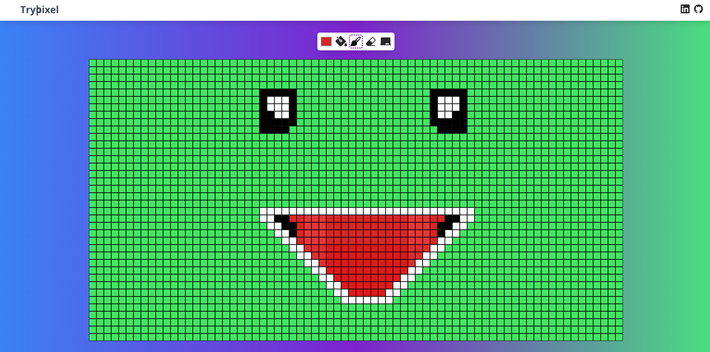

# Trypixel
Trypixel is a web application that allows users to create pixel art. The app is designed to provide users with a simple and intuitive interface for creating pixel art, allowing them to unleash their creativity.

## Features

- Color Selection: Use the Color Picker to select colors 
- Paintbrush:** Apply colors pixel by pixel.
- Background Control: Change the background color swiftly with the Paint Bucket tool.
- Eraser: Clear individual pixels.
- Erase All: Clear all the pixels instantly with the Erase All tool.

## Technologies

TryPixel is built using the following technologies:

* React
* Next.js
* TypeScript
* Tailwind CSS

## Getting Started
1. Clone this repository:
```bash

git@github.com:markoclimakodev/trypixel.git

```

2. Access the project folder
```

cd trypixel

```

3. Install the dependencies
```

npm install

```

4. Run the project
```

npm run dev

```

## Screenshot



## Deployment

- [Trypixel on Vercel](https://trypixel.vercel.app/)

## Contact

Feel free to connect with me on LinkedIn or email.

- LinkedIn: [markoclimako](https://www.linkedin.com/in/markoclimako/)
- Email: mkclimako@gmail.com
